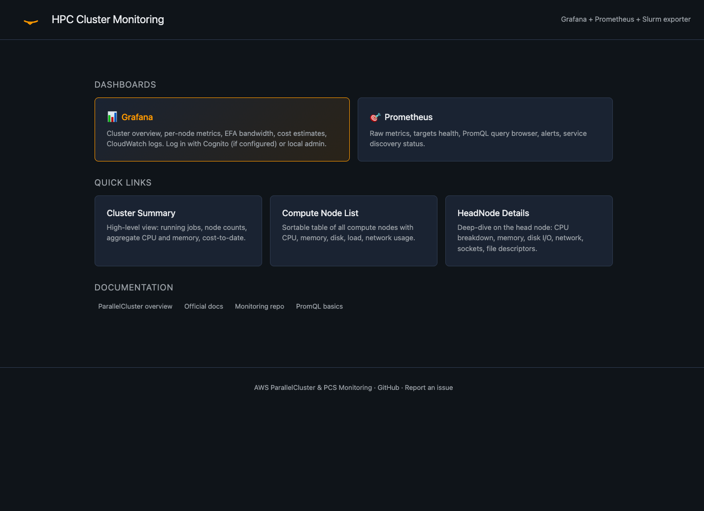
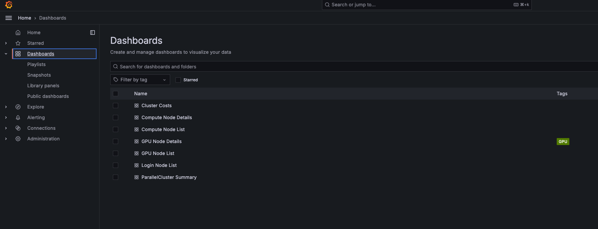
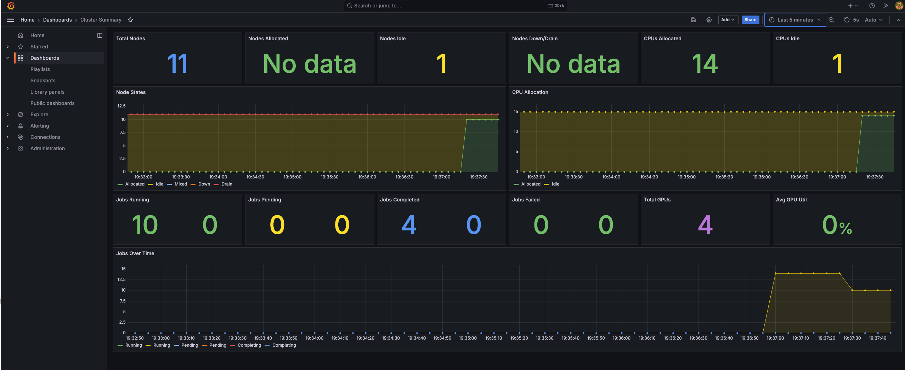
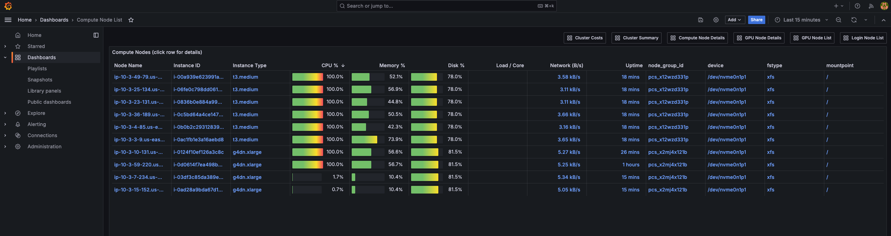
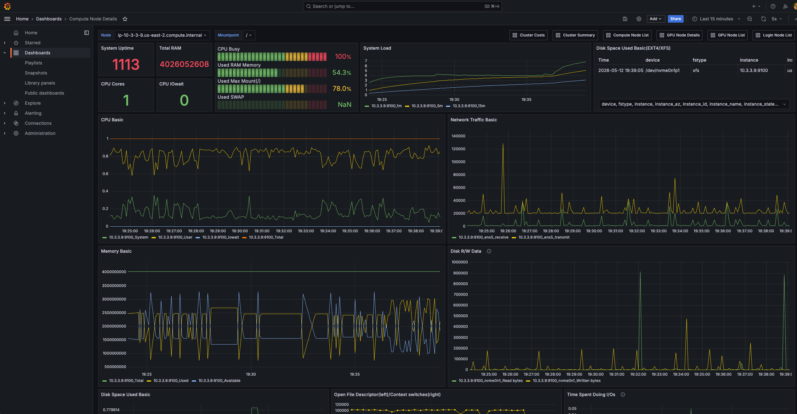
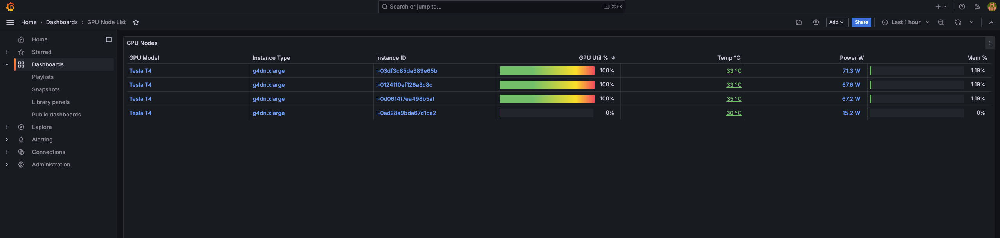
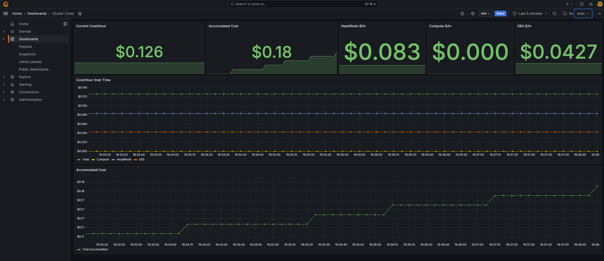

# HPC Cluster Monitoring Dashboard <br/> for AWS ParallelCluster & AWS PCS

A zero-setup monitoring solution for HPC clusters built with
[AWS ParallelCluster](https://aws.amazon.com/hpc/parallelcluster/) or
[AWS Parallel Computing Service (PCS)](https://aws.amazon.com/pcs/).
Deploys Prometheus, Grafana, node_exporter, NVIDIA DCGM exporter, and
Slurm metrics as containers — no manual configuration required.

## Features

- **Dual-platform**: works on both ParallelCluster and AWS PCS
- **Zero-setup**: add a few lines to your config, create the cluster, done
- **Slurm 25.11 native metrics** (PCS): scrapes OpenMetrics directly from slurmctld — no extra exporter
- **Per-user / per-account / per-partition visibility**: see who's using what, queue health, scheduler RPC stats
- **GPU profiling**: SM activity, tensor-core utilization, FP64/32/16 pipe activity (Volta+)
- **GPU health monitoring**: XID errors, throttle reasons, ECC counters, NVLink errors, retired pages
- **Secure by default**: per-cluster random password in SSM, optional Cognito SSO
- **GPU-ready**: NVIDIA DCGM exporter with custom counters auto-deploys on GPU instances
- **EFA fabric metrics**: bandwidth, packet rate, RDMA read/write throughput, SRD retransmits and work-request errors — collected automatically on EFA hardware
- **Amazon RES desktop monitoring**: monitor Research and Engineering Studio VDI desktops (CPU, RAM, GPU) for rightsizing, on the same stack — opt-in, discovered by `res:EnvironmentName` tag
- **Cost tracking**: real-time cost/hour estimates + accumulated total (includes PCS controller cost)
- **Job mapping**: see which Slurm jobs run on which nodes
- **Log search in Grafana**: CloudWatch Logs (slurmctld, slurmd, cluster daemons, bootstrap) browsable from a dashboard (ParallelCluster)
- **Works with `Imds.Secured=true`**: no IMDS workarounds needed

## Dashboards

| Dashboard | Platform | Description |
|-----------|----------|-------------|
| **Cluster Summary** | Both | Cluster overview: Slurm states, CPU/memory aggregates, idle node-hours, top users / partitions |
| **Slurm Detail** | Both | Per-partition / per-user / per-account breakdown, queue health, scheduler RPC stats, license usage |
| **Compute Node List** | Both | Fleet table with CPU/Mem/Disk/Network gauges, Queue column, job info, click-through |
| **Compute Node Details** | Both | Per-node deep-dive (CPU, memory, disk, network, EFA bandwidth/RDMA/retransmits/errors) |
| **RES Node List** | RES | Amazon RES desktop fleet: Owner, Project, instance type, CPU/Mem/GPU/Disk gauges, network, uptime — click-through to details |
| **RES Node Details** | RES | Per-desktop deep-dive (CPU, memory, disk, network), mirroring Compute Node Details |
| **GPU Node List** | Both | GPU fleet table: model, utilization, temp, power, memory — click-through by hostname |
| **GPU Node Details** | Both | Per-GPU workload metrics + Compute Pipeline activity (SM, tensor, FP64/32/16) + system metrics (CPU/mem/disk/net) |
| **GPU Health** | Both | Cluster-wide GPU faults: XID errors, throttle reasons, ECC, NVLink + PCIe errors, retired pages |
| **HeadNode Details** | ParallelCluster | Head node metrics |
| **Login Node List** | PCS | Login nodes table with click-through to node details |
| **Cluster Costs** | Both | Cost/hour breakdown (headnode/login, compute, EBS, PCS controller) + accumulated total |
| **Storage (FSx + EFS)** | Both | FSx Lustre throughput, IOPS, capacity, CPU/disk utilization; EFS throughput, IO limit, connections, storage |
| **Cluster Logs** | ParallelCluster | Searchable CloudWatch Logs (slurmctld, slurmd, clustermgtd, computemgtd, cfn-init, cloud-init) with log-group picker and text filter |


## Screenshots

### Landing page
Entry point served at `https://<host>/` with links to Grafana, Prometheus, and
the most-used dashboards.



### Dashboard list
All dashboards available in Grafana. On PCS the **Login Node List** replaces
**HeadNode Details**; GPU dashboards (List + Details) are available on both
platforms.



### Cluster Summary
High-level cluster view: Slurm node states, CPU allocation, running/pending/
completed/failed jobs, total GPUs, and average GPU utilization. Works on both
ParallelCluster and PCS (PCS metrics are translated via Prometheus recording
rules).



### Compute Node List
Sortable table of every compute node with live gauges for CPU, memory, disk,
load, and uptime. Click any row to drill down into per-node details.



### Compute Node Details
Per-node deep dive: CPU breakdown (user/system/iowait), memory, load average,
disk I/O, network throughput, file descriptors, context switches, and more.
EFA panels auto-populate on EFA-enabled hardware.



### GPU Node List
Fleet view of GPU nodes with model, utilization, temperature, power, and
memory gauges. Click any row to open the detailed per-GPU dashboard.



### Cluster Costs
Real-time cost/hour and accumulated cost since cluster start, broken down by
component (head/login node, compute, EBS, PCS controller). List prices via AWS
Pricing API, cached for 24h.



## Quickstart — ParallelCluster

Add to your `pcluster.yaml` under **both** `HeadNode` and each `SlurmQueue`:

```yaml
CustomActions:
  OnNodeConfigured:
    Script: https://raw.githubusercontent.com/aws-samples/aws-parallelcluster-monitoring/main/post-install.sh
    Args:
      - latest
Iam:
  AdditionalIamPolicies:
    - Policy: arn:aws:iam::aws:policy/AmazonSSMManagedInstanceCore
    - Policy: arn:aws:iam::<account-id>:policy/pcluster-monitoring-<cluster-name>
```

> **Pinning a version**: replace `latest` with a specific tag (e.g. `v2.6`)
> if you need reproducible deployments. `latest` always pulls the newest
> release from the `main` branch.

For a complete working example, see
[test-clusters/pc-cluster.yaml](test-clusters/pc-cluster.yaml).

Generate the least-privilege policy:

```bash
./iam/render-policy.sh <cluster-name> <region> > /tmp/policy.json
aws iam create-policy --policy-name pcluster-monitoring-<cluster-name> \
    --policy-document file:///tmp/policy.json
```

See [iam/README.md](iam/README.md) for details.

> **Quick start alternative**: use these AWS-managed policies instead (overbroad but functional):
> ```yaml
> Iam:
>   AdditionalIamPolicies:
>     - Policy: arn:aws:iam::aws:policy/AmazonSSMManagedInstanceCore
>     - Policy: arn:aws:iam::aws:policy/CloudWatchFullAccess
>     - Policy: arn:aws:iam::aws:policy/AWSPriceListServiceFullAccess
>     - Policy: arn:aws:iam::aws:policy/AmazonSSMFullAccess
>     - Policy: arn:aws:iam::aws:policy/AWSCloudFormationReadOnlyAccess
> ```

## Quickstart — AWS PCS

### 1. Enable Slurm OpenMetrics on your cluster

```bash
aws pcs update-cluster --cluster-identifier <cluster-id> \
    --slurm-configuration 'slurmCustomSettings=[{parameterName=MetricsType,parameterValue=metrics/openmetrics},{parameterName=CommunicationParameters,parameterValue=enable_http}]'
```

Ensure your security group allows port 6817 from the login node to the slurmctld endpoint.

### 2. Configure launch templates

Node type (login vs compute) is determined by the `monitoring-role` tag, not by
`Name`. The `Name` tag is free for arbitrary operator use. Login nodes
(`monitoring-role=login`) are excluded from EC2 service discovery and scraped by
the static `login_node` job as `instance_name=HeadNode`; every other discovered
node is reported as `instance_name=Compute`.

**Login node** launch template (runs the monitoring stack):
- Tag: `monitoring-role=login`, `pcs-cluster-id=<cluster-id>` (`Name` is free)
- `MetadataOptions.InstanceMetadataTags=enabled`
- User data (MIME multipart):

```bash
#!/bin/bash
curl -fsSL https://raw.githubusercontent.com/aws-samples/aws-parallelcluster-monitoring/main/post-install.sh \
    -o /tmp/post-install.sh
bash /tmp/post-install.sh latest
```

**Compute node** launch template (runs node_exporter + dcgm-exporter):
- Tag: `monitoring-role=compute` (optional — a node with no `monitoring-role`
  tag is treated as compute; `Name` is free)
- `MetadataOptions.InstanceMetadataTags=enabled`
- Same user data as above

> **Newer GPUs (e.g. B300):** the dcgm-exporter image defaults to a build
> that pulls cleanly on Docker 29.x but only covers up to B200. For GPUs
> needing DCGM ≥ 4.4.0 (such as B300 / p6-b300), export
> `DCGM_EXPORTER_IMAGE` before the installer runs — set it in the compute
> node's user data. Supply the image **by digest** to bypass the Docker
> 29.x OCI-index pull failure, e.g.
> `export DCGM_EXPORTER_IMAGE=nvcr.io/nvidia/k8s/dcgm-exporter@sha256:<digest>`.
> Leave it unset to use the default.

### 3. IAM instance profile permissions

The instance profile needs:
- `pcs:GetCluster`, `pcs:ListComputeNodeGroups`, `pcs:RegisterComputeNodeGroupInstance`
- `ec2:DescribeInstances`, `ec2:DescribeVolumes`, `ec2:CreateTags`
- `ssm:GetParameter`, `ssm:PutParameter`
- `pricing:GetProducts`
- `kms:Decrypt` (condition: via `ssm.<region>.amazonaws.com`)

**Important**: the IAM role name must start with `AWSPCS` or use path
`/aws-pcs/` (PCS requirement for compute-node-group instance profiles).

### Access Grafana

**Option A — Public subnet (head/login node has a public IP):**

If your head node or login node is in a public subnet with a public IP,
just open port 443 in the instance's security group and browse directly:

```
https://<public-ip>/grafana/
```

The self-signed certificate will trigger a browser warning — click
through it (the connection is still encrypted).

**Option B — Private subnet (SSM port-forward):**

If the head/login node is in a private subnet (no public IP), use SSM
Session Manager to tunnel the HTTPS port to your laptop:

```bash
aws ssm start-session --target <instance-id> --region <region> \
    --document-name AWS-StartPortForwardingSession \
    --parameters 'portNumber=["443"],localPortNumber=["8443"]'
```

Then browse: `https://localhost:8443/grafana/`

**Retrieve the admin password:**

```bash
aws ssm get-parameter --region <region> \
    --name /<platform>/<cluster-name>/grafana/admin-password \
    --with-decryption --query Parameter.Value --output text
```

Where `<platform>` is `parallelcluster` or `pcs`.

For public access with a trusted certificate (ALB + ACM), see
[docs/public-access.md](docs/public-access.md).

### Optional: Cognito SSO

Replace the local `admin` login with corporate SSO via an Amazon
Cognito User Pool. Users sign in through Cognito's hosted UI; the
local admin remains as a fallback if Cognito is misconfigured.

Quick setup (full instructions in [cognito/README.md](cognito/README.md)):

```bash
# 1. Create a Grafana app client in your existing Cognito user pool
./cognito/setup-grafana-client.sh <pool-id> <grafana-host> [region]

# 2. Store the config as an SSM SecureString
aws ssm put-parameter \
    --region <region> \
    --name "/<platform>/<cluster>/grafana/cognito" \
    --type SecureString \
    --value '{
        "user_pool_id":   "<pool-id>",
        "client_id":      "<from-step-1>",
        "client_secret":  "<from-step-1>",
        "domain":         "<your-cognito-hosted-ui-domain>",
        "region":         "<region>",
        "allowed_domains": "example.com"
    }'

# 3. Re-run the installer (or recreate the cluster)
sudo bash /opt/aws-parallelcluster-monitoring/installer/install.sh
sudo docker restart grafana
```

When the SSM parameter is present, Grafana shows a **Sign in with
Cognito** button on the login page. The client secret is materialized
to tmpfs (`/run/grafana-secrets/cognito-client-secret`, mode 0640,
owned `472:472`) and read by Grafana via
`GF_AUTH_GENERIC_OAUTH_CLIENT_SECRET__FILE` so it never appears in
container env or `docker inspect`.

### Testing from a fork

```yaml
# ParallelCluster
Args:
  - <tag-or-branch>
  - <you>/aws-parallelcluster-monitoring

# PCS (in user data)
bash /tmp/post-install.sh <tag-or-branch> <you>/aws-parallelcluster-monitoring
```

## Monitoring Amazon RES desktops

If you run [Amazon Research and Engineering Studio
(RES)](https://aws.amazon.com/hpc/res/) alongside a ParallelCluster or PCS
cluster, you can monitor RES VDI desktops on the **same** monitoring stack —
useful for rightsizing (e.g. spotting an overprovisioned `g5.48xlarge` whose
GPUs sit idle). RES desktops appear in their own **RES Node List** /
**RES Node Details** dashboards, separate from the Slurm compute fleet.

This is fully opt-in: nothing changes unless you set `RES_ENVIRONMENT_NAME`.

### 1. Enable RES discovery on the monitoring node

On the ParallelCluster head node (or PCS login node) already running the
stack, re-run the installer with `RES_ENVIRONMENT_NAME` set to your RES
environment name (the value of the `res:EnvironmentName` tag RES puts on its
resources):

```bash
sudo RES_ENVIRONMENT_NAME=<your-res-env-name> bash /opt/aws-parallelcluster-monitoring/installer/install.sh
sudo docker restart prometheus
```

This appends a `res_instances` Prometheus scrape job that discovers every
running instance tagged `res:EnvironmentName=<your-res-env-name>` and labels
them `instance_name="RES"`. The head node's IAM role already has
region-scoped `ec2:DescribeInstances`, so no IAM change is needed when RES is
in the same region.

### 2. Run the exporters on the RES desktops

Add the installer to your **RES project launch script** (RES → Project →
launch template, Linux script) so each desktop runs node_exporter (and
dcgm-exporter on GPU desktops):

```bash
curl -fsSL https://raw.githubusercontent.com/aws-samples/aws-parallelcluster-monitoring/main/post-install.sh \
    -o /tmp/post-install.sh
RES_ENVIRONMENT_NAME=<your-res-env-name> bash /tmp/post-install.sh latest
```

The desktop is detected as a RES compute node either from the
`RES_ENVIRONMENT_NAME` you pass, or from the `res:EnvironmentName` instance
tag via IMDS (requires `InstanceMetadataTags=enabled` on the launch
template). Already-running desktops can be enrolled by running the same
command over SSM.

> **Note:** the desktop's security group must allow the monitoring node to
> reach port `9100` (and `9400` for GPU desktops), the same as for compute
> nodes.

### 3. View the dashboards

Open **RES Node List** in Grafana. Each row links to **RES Node Details**.
The Owner and Project columns come from the RES `res:Owner` / `res:Project`
tags; the GPU% column populates on GPU desktops so idle-GPU rightsizing
candidates stand out.

## Supported platforms

| Platform | Slurm Source | Notes |
|----------|-------------|-------|
| ParallelCluster 3.10–3.15 | rivosinc/prometheus-slurm-exporter | AL2, AL2023, Ubuntu 22/24, RHEL 9 |
| AWS PCS (Slurm 25.11+) | Native OpenMetrics (slurmctld:6817) | AL2023 |

## Architecture

```
ParallelCluster HeadNode / PCS Login Node
┌─────────────────────────────────────┐       Compute Nodes
│ nginx (TLS)                         │       ┌──────────────────────┐
│ grafana :3000                       │       │ node_exporter :9100   │
│ prometheus :9090                    │◄──────│ dcgm-exporter :9400   │
│ pushgateway :9091                   │       │   (GPU nodes only)    │
│ node_exporter :9100                 │       └──────────────────────┘
│ slurm_exporter :9092 (PC only)     │
│ cost-metrics (cron)                 │       Slurm Controller
│ slurm-job-nodes (timer)             │       │ :6817/metrics/*       │
│   (head + PCS login)                │◄──────│   (PCS only)          │
│ Prometheus recording rules          │       │   (PCS only)          │
│   (PCS: native → compat names)     │       └──────────────────────┘
└─────────────────────────────────────┘
```

## Components

| Component | Version |
|-----------|---------|
| Grafana | 13.0.2 |
| Prometheus | v3.12.0 |
| Pushgateway | v1.11.3 |
| Node Exporter | v1.11.1 |
| NGINX | 1.27-alpine |
| NVIDIA DCGM Exporter | 4.2.0-4.1.0-ubuntu22.04 |
| prometheus-slurm-exporter | 1.8.0 (ParallelCluster only) |
| Docker Compose | 5.1.4 |
| CloudWatch Exporter | v0.16.0 |

All images pinned — `latest` is never used.

## Security

- **Grafana password**: random 32-char hex, stored in SSM Parameter Store (SecureString)
- **Cognito SSO**: optional OAuth2 login — see [cognito/README.md](cognito/README.md)
- **IAM**: least-privilege policy available — see [iam/README.md](iam/README.md)
- **TLS**: self-signed cert with SANs (localhost, private IP, hostname)
- **IMDS**: works with `Imds.Secured=true` via credential sidecar
- **No secrets in code**: passwords, tokens, and keys are in SSM or tmpfs only

## Documentation

- [Public access (ALB + ACM)](docs/public-access.md)
- [IMDS credential sidecar design](docs/imds-secured-design.md)
- [Least-privilege IAM policy](iam/README.md)
- [Cognito SSO setup](cognito/README.md)

## Roadmap

- Amazon Managed Prometheus / Managed Grafana path
- CDK module for automated deployment
- CI pipeline (shellcheck, hadolint, smoke tests)

## License

MIT-0 — see [LICENSE](LICENSE).
